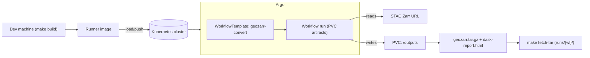

# data-model-pipeline

Argo-native workflow for converting **STAC Zarr** items to **GeoZarr**, using the `eopf-geozarr` converter from the [data-model](https://github.com/EOPF-Explorer/data-model) repo.

This repository provides the **orchestration layer** (Docker image + Argo WorkflowTemplate + Make targets). The **converter implementation** and **dependency lock** live in `data-model`. At build time, we fetch `pyproject.toml` and `uv.lock` from `data-model@REF`, install those third-party dependencies exactly, then install `eopf-geozarr` from the same ref **without re-resolving**. This keeps runtime behavior reproducible while allowing this repo to evolve independently as the pipeline runner.

---

## High-level overview

### What this does
- **Builds a runner image** that contains a _locked_ geospatial Python stack (from `data-model@REF`) plus the `eopf-geozarr` CLI.
- **Applies an Argo WorkflowTemplate** that:
  - Preflights the STAC Zarr URL (best-effort HTTP HEAD).
  - Normalizes/validates **group paths** using xarray (prints a small tree of available groups).
  - Runs the conversion: `eopf-geozarr convert …` with optional Dask performance report.
  - Packages outputs into a tarball on a per-run **PVC** for retrieval.
- **Convenience Make targets** to build, load/push, install Argo, submit runs, and fetch artifacts.

### Why a separate repo?
- **Separation of concerns**: `data-model` provides the GeoZarr data model and converter; this repo provides orchestration and infra glue.
- **Reproducible builds**: we consume `data-model`’s **`uv.lock`** directly to freeze third-party deps, then install `eopf-geozarr` _without_ dependency resolution.
- **Safe iteration**: change the workflow, image, or cluster tooling without touching the converter library.

### Architecture (conceptual)


---

## Quickstart

```bash
# 0) Build the image (uses data-model@<ref> lockfile, then installs eopf-geozarr with --no-deps)
make build REF=<commit-sha-or-tag> TAG=dev
# TIP (arm64 or wheel gaps): add PORTABLE=1

# 1) Load into your k3d dev cluster and install Argo
make load-k3d
make argo-install

# 2) Apply the WorkflowTemplate and submit a run
make template
make submit \
  STAC_URL="https://…/S2B_MSIL2A_20250518…zarr" \
  OUTPUT_ZARR="./S2B_MSIL2A_20250518_T29RLL_geozarr.zarr" \
  GROUPS="measurements/reflectance/r20m"

# 3) Fetch artifacts (tarball + optional dask-report.html) from the PVC
make fetch-tar
```
Artifacts land under `runs/<workflow-name>/`.

---

## Repository layout

- `docker/Dockerfile` — builds the runner image.
  - Downloads `pyproject.toml` + `uv.lock` from `data-model@REF` (optionally a subdir).
  - `uv export` → exact requirements; installs **third-party deps** first.
  - Installs `eopf-geozarr` from the same ref **with `--no-deps`**.
- `workflows/geozarr-convert-template.yaml`
  - Preflight (HEAD) the STAC URL (best-effort; non-fatal).
  - Normalize/echo groups; validate with xarray (prints tree; fails early with suggestions).
  - Run `eopf-geozarr convert … --dask-cluster --dask-perf-html …`.
  - Tar the GeoZarr into `/outputs/geozarr.tar.gz`; expose artifacts from PVC.
- `Makefile` — build → load/push → argo install → template → submit → fetch → clean.

---

## Build options

```bash
# Default (wheel-first): fast, small image
make build REF=main TAG=dev

# Portable build (adds system GDAL/PROJ toolchain; robust if wheels are missing on your arch)
make build REF=main TAG=dev PORTABLE=1

# If eopf-geozarr lives in a subdir in data-model, pass SUBDIR (must end with '/')
make build REF=main SUBDIR=tools/eopf-geozarr/ TAG=dev
```

- Image defaults to `ghcr.io/eopf-explorer/data-model-pipeline:<TAG>`.
- If you don’t push, keep `imagePullPolicy: IfNotPresent` in the template and run `make load-k3d`.

---

## Workflow parameters

From `workflows/geozarr-convert-template.yaml`:

| Parameter         | Type    | Description                                                                                  | Example(s) |
|-------------------|---------|----------------------------------------------------------------------------------------------|------------|
| `stac_url`        | string  | STAC Zarr URL to convert                                                                     | `https://…/S2B_MSIL2A_…zarr` |
| `output_zarr`     | string  | Output path (container FS)                                                                   | `./S2B_MSIL2A_…_geozarr.zarr` |
| `groups`          | string  | **Space-separated** group paths. Leading `/` optional; template normalizes.                  | `measurements/reflectance/r20m /measurements/reflectance/r10m` |
| `dask_perf_html`  | string  | Path to write Dask performance report (optional)                                             | `out/debug/dask-report.html` |

Override via env on submit:
```bash
make submit \
  STAC_URL="https://…" \
  OUTPUT_ZARR="./S2B_MSIL2A_…_geozarr.zarr" \
  GROUPS="/measurements/reflectance/r20m /measurements/reflectance/r10m"
```

---

## Typical workflows

### Local dev with k3d
```bash
make build REF=<ref> TAG=dev
make load-k3d
make argo-install
make template
make submit
make fetch-tar
```

### Pushing to GHCR (any cluster)
```bash
echo $GHCR_TOKEN | docker login ghcr.io -u <user> --password-stdin
docker push ghcr.io/eopf-explorer/data-model-pipeline:dev

# Ensure the cluster can pull from GHCR (public image or imagePullSecret)
make argo-install
make template
make submit
make fetch-tar
```

---

## How the conversion step works

1. **Validation** with xarray: opens the STAC, prints a group tree; errors list missing groups and suggested candidates under `/measurements`.
2. **Execution** uses `eopf-geozarr convert` with `--dask-cluster` enabled and optional `--dask-perf-html`.
3. **Packaging** copies the Dask HTML (if produced), and tars the GeoZarr output dir for a single-file artifact.
4. **Artifacts** are exposed from the per-run PVC and retrievable via `make fetch-tar`.

---

## Troubleshooting

- **ImagePullBackOff**: If using a local tag, run `make load-k3d`. Keep `imagePullPolicy: IfNotPresent`.
- **`rasterio`/GDAL import errors**: rebuild with `PORTABLE=1` and re-apply the template.
- **STAC URL preflight fails**: the HEAD is best-effort; the actual open happens during conversion and will surface real errors.
- **Group not found**: review the printed tree; use normalized absolute paths like `/measurements/reflectance/r20m`.
- **No artifacts after run**: check workflow status (`argo get -n argo @latest --output wide`). Then `make fetch-tar` to pull into `runs/<WF>/`.

---

## Clean up

```bash
# Remove workflows and completed pods
make clean

# Remove per-run PVCs (deletes artifacts)
make clean-pvc
```

---

## Reproducibility & versioning

- The runner image installs third-party dependencies from `data-model@REF`’s **`pyproject.toml` + `uv.lock`**, then installs `eopf-geozarr` from the same ref **with `--no-deps`**.  
- To reproduce/upgrade the stack, bump `REF` (or a specific commit SHA) and rebuild:
  ```bash
  make build REF=<new-sha> TAG=dev
  ```

---

## Roadmap (suggested)

- Publish CI workflow that builds `:sha` and `:main` images on push.
- Add a sample STAC catalog and golden-test to smoke the template offline.
- Optionally publish a Helm chart wrapping the WorkflowTemplate + RBAC + imagePullSecrets.
- Parameterize Dask cluster settings (threads/memory) in the template.
- (If needed) toggle a “no-tar” mode to emit a directory tree directly to PVC.

---

## License

See `LICENSE` in this repository.
